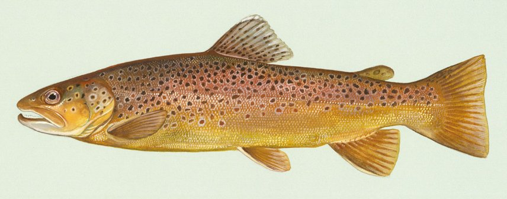

# Trout, Brown

Distribution: 
Yes! Oklahoma has two introduced species of trout — rainbows and browns, with rainbow trout being far more abundant. Rainbow trout are native to the cold streams west of the Continental Divide but have been introduced here and elsewhere. The brown, or German brown trout is originally from Europe. Browns are stocked periodically in the Mountain Fork River below Broken Bow Lake and in the Illinois River below Lake Tenkiller.  Rainbows are stocked approximately every two weeks at all eight of the state’s trout areas during the designated trout seasons.
Large trout are not yet commonplace in Oklahoma trout areas although "bragging" size fish are occasionally landed.  When heading to one of Oklahoma's  trout areas be sure to brush up on the regulations.

Description: 
Oklahoma's two trout species can be easily identified.  First look at the side of the fish.  A brown trout will have orange and red spots, but a rainbow trout will be iridescent.  The brown trout will have few or no black spots on its tail and a creamy belly.  In comparison, the rainbow trout will have black spots on its tail and a white belly.

Habitat: 
 Trout tend to seek out and congregate in calm waters. So when fishing in swift waters, cast your bait above exposed boulders and let it drift down through the calm water on the downstream side of the outcropping.

Natural Food Sources: 
Browns commonly feed on mayfly and caddisfly nymphs, grasshoppers, worms, crayfish and minnows. 

Spawning: 
There is no evidence of brown trout spawning in Oklahoma waters.

Facts: 
Brown trout have a natural ability to withstand warmer water temperatures and higher turbidity than rainbows. In a typical trout stream, rainbows tend to occupy faster moving water while browns can tolerate the more slack stretches. Even though they are hardier than rainbows, browns still require and prefer clear cold waters, and most actively feed when water temperatures range from 50 to 60 degrees.
Because the brown trout feeds a great deal on the surface they have become very popular with fly fishermen. The stocky brown is a bulldog fighter when hooked, occasionally leaping out of the water. Fishing for browns is best on overcast days, in early morning before the sun is up, and at night. On bright days fish are more often found in the shade of undercut banks or overhanging vegetation.
Browns commonly feed on mayfly and caddisfly nymphs, grasshoppers, worms, crayfish and minnows. The brown’s varied diet enables anglers to employ some of the same methods used to catch rainbows. However, at Oklahoma’s Mountain Fork River designated trout area, fishing in some areas is restricted to artificial flies and lures with barbless hooks only.

